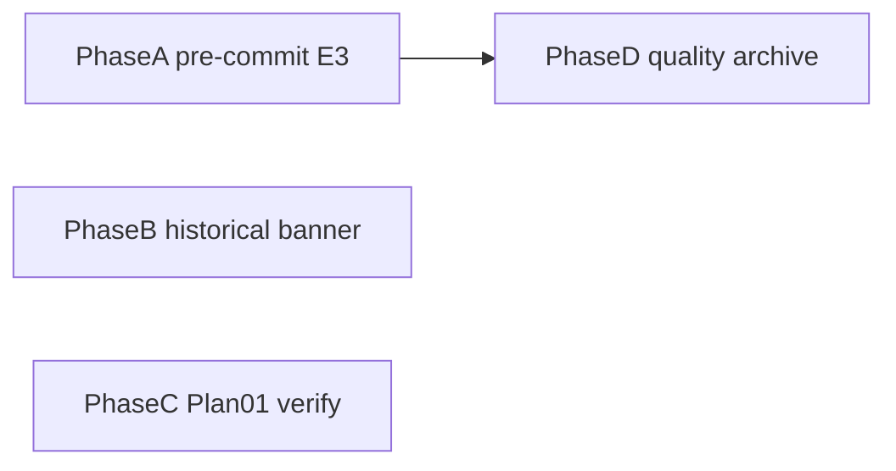

# Quality-Plan Outstanding Closeout

**Status:** ✅ COMPLETED (Verified Complete — Full completion; verified and archived 2026-09-27 via [`04-documentation/03-mark-completed.md`](../../../04-documentation/03-mark-completed.md))

## Scope decision

This plan covers **actionable leftovers from the quality-plan thread**, not the full [`TODO.md`](../../plans/TODO.md) backlog.

**In scope**
1. Quality-plan E3: expand [`scripts/hooks/pre-commit`](../../../scripts/hooks/pre-commit)
2. Mark [`00-Meta-Workflow/00-meta/agent-flexibility-review.md`](../../../00-Meta-Workflow/00-meta/agent-flexibility-review.md) Historical (keep the January 2026 path snapshot)
3. Verify [`v1.82-fixes/01-reconcile-research-and-source-integrity.md`](../review/2026-09-22-reconcile-research-and-source-integrity.md) against `9714c15`; archive only if every task verifies
4. Full-complete and archive the quality plan after E3

**Out of scope (leave in TODO with existing triggers)**
- Flash-UI host pilot (host-owner authorization)
- Superseded-plan lint, research filename convention, host verify gates, ADRs/KI-12 (trigger not met)
- Behavioral evidence / Plan 03 harness, Plan 04/05/06, July open KIs, multi-model plan review, v2 redesign review, deep-review battle-test, sync measurement, `00-Meta-Workflow/` → `00-project/` migration

Repo: `/Users/jesse/Development/Shared-Common-Library/Workflow-Scripts` on `v1.82`.

## Phase A — Expand pre-commit (quality-plan E3)

**Current hook** only runs `check-meta-logs.sh --staged`:

```1:4:Shared-Links/Workflow-Scripts/scripts/hooks/pre-commit
#!/usr/bin/env bash
# Enable once per clone: git config core.hooksPath scripts/hooks
set -euo pipefail
exec bash "$(git rev-parse --show-toplevel)/scripts/validation/check-meta-logs.sh" --staged
```

**Review lock (2026-09-27):** the hook currently ends with `exec`, so later checks never run. Replace `exec` with sequential calls; exit non-zero on the first failure.

`check-plan.sh` reads the worktree file, not the index. For each staged `*.md` under `00-project/plans/` (exclude `plans-completed/`):
- If `git diff --quiet -- "$path"` fails (unstaged edits), fail the hook and tell the user to stage the full file.
- If the staged file's worktree text contains `**Tier:**`, run `check-plan.sh` on that path.

**Change:** keep meta-logs; then, in order:
1. `check-completion-chain-policy.sh`
2. `check-planning-build-policy.sh`
3. Tiered staged-plan `check-plan.sh` as above

Do **not** add the active-link checker to pre-commit (CI already runs it).

**Verify**
- Dry-run a copy of `scripts/validation/fixtures/check-plan/missing-verify.md` as a staged Tier plan → hook exits non-zero
- Dry-run `scripts/validation/fixtures/check-plan/t2-pass.md` staged with no unstaged delta → `check-plan.sh` does not fail
- `check-plan-selftest.sh` and planning-build selftest still pass
- Enablement stays `git config core.hooksPath scripts/hooks` (already in the hook comment)

**Files:** `scripts/hooks/pre-commit`; fixture under `scripts/validation/fixtures/` if needed for a local dry-run; changelog `changed/` + index; tick E3 on the quality plan.

## Phase B — Mark agent-flexibility-review historical

**Review lock:** do not rewrite paths. Confirmed stale citations include `02-build-code/01-execution.md` at line 211 and the Implementation Status list at lines 390 and 407 (`02-build-code`, `05-review-audit`, `03-debug`, `06-security`). Those names match the 2026-01-26 tree this review recorded. Current policy lives in `workflow-applicability.md` and the numbered workflows.

Set **Status** to `Historical (archived)` using the same banner style as [`parallel-agents-review.md`](../../../00-Meta-Workflow/00-meta/parallel-agents-review.md) (that file is already `Historical (archived)` and still points here). Add one note that path names inside the body are the January 2026 snapshot.

**Verify:** header Status is Historical; TODO row checked off; body snapshot paths left intact.

**Files:** `00-Meta-Workflow/00-meta/agent-flexibility-review.md`; changelog `docs/`; TODO row.

## Phase C — Plan 01 status reconcile

Plan 01 Status still says source recovery is pending, and its P0–P3 boxes are still `[ ]`. Commit `9714c15` plus [`2026-09-26-v1-82-source-integrity-reconciliation.md`](../../research/v1.82-fixes/2026-09-26-v1-82-source-integrity-reconciliation.md) is the evidence packet. The roadmap still says the protocol path is absent; that sentence is stale.

Run [`03-mark-completed.md`](../../../04-documentation/03-mark-completed.md) on Plan 01:
- Tick a task `[✅]` only when that task's exit evidence is in `9714c15` or the reconciliation report.
- **Full completion and archive** to `plans-completed/review/` only when every P0–P3 task verifies.
- If any task lacks evidence, use **Reconcile only**: leave that task `[ ]`, do not archive, and record the gap in Current state.
- Either way, update the roadmap protocol sentence and the TODO Plan 01 / Astra wording so they no longer say the links are unrepaired.

## Phase D — Close quality plan

After Phase A (E3 is the only open quality-plan task). Phases B and C do not gate this archive.
1. Refresh quality-plan Current state (E3 done; remaining debt list is trigger-gated only)
2. Run `03-mark-completed.md` Full completion on [`2026-09-25-planning-and-build-workflow-quality-implementation-plan.md`](./2026-09-25-planning-and-build-workflow-quality-implementation-plan.md)
3. Archive to `plans-completed/implementation/` (workflow/code changes)
4. Transfer still-open Deferred & Debt into TODO without claiming closure (Flash-UI, superseded-plan lint, research naming, host verify gates, ADRs, behavioral evidence)
5. Push `v1.82`; confirm Validation green

## Ordering



A, B, and C touch disjoint files and may run together. Only A blocks D.

## Success criteria

- E3 ticked; hook expands validators as specified; local dry-run blocks bad staged Tier plans
- `agent-flexibility-review.md` header is Historical; January 2026 path snapshot is unchanged
- Plan 01 is either archived Verified Complete or left active in Reconcile only with unverified tasks still open
- Quality plan archived Verified Complete; TODO holds only trigger-gated debt + unrelated backlog
- Remote Validation success on the push that lands this closeout

## Verification (2026-09-27, via `04-documentation/03-mark-completed.md` — Full completion)

1. [✅] **Phase A — E3 pre-commit expansion.** `scripts/hooks/pre-commit` now runs meta-logs, then completion-chain and planning-build policy checks, then tiered `check-plan.sh` for fully staged active `00-project/plans/**.md` files with a `**Tier:**` line; no `exec`; enablement comment retained. `check-plan-selftest.sh`, `check-planning-build-policy.sh`, and `check-completion-chain-policy.sh` all exit 0; direct fixture checks: `missing-verify.md` → exit 1, `t2-pass.md` → exit 0. Logged in `changelog/changed/2026-09-27-changed-pre-commit-validator-expansion.md`; quality-plan E3 ticked (commit `8761af4`).
2. [✅] **Phase B — agent-flexibility historical banner.** Header reads `Status: Historical (archived)` with the January 2026 snapshot note; body snapshot paths intact; changelog `docs/2026-09-27-docs-agent-flexibility-review-historical.md`; TODO row resolved in `8761af4`.
3. [✅] **Phase C — Plan 01 reconcile.** Plan 01 archived at [`../review/2026-09-22-reconcile-research-and-source-integrity.md`](../review/2026-09-22-reconcile-research-and-source-integrity.md) as **Verified Complete** on `9714c15`; all P0–P3 tasks `[✅]`; roadmap line 14 and TODO Plan 01/Astra wording updated (`8761af4`, `d760259`).
4. [✅] **Phase D — quality plan archive + CI.** Quality plan archived at [`2026-09-25-planning-and-build-workflow-quality-implementation-plan.md`](./2026-09-25-planning-and-build-workflow-quality-implementation-plan.md) as **Verified Complete**; trigger-gated debt preserved in `plans/TODO.md`; `v1.82` in sync with `origin/v1.82`; Validation green on the closeout push — run `36320684530` on `d760259` (intermediate failure `36320638891` on `098a35c` repaired by `d760259`).

All five success criteria verified. Archived to `plans-completed/implementation/` per host filing policy (plans-completed index row + changelog Type=plan row).
