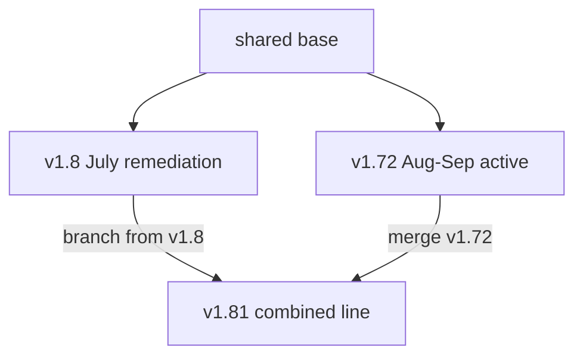

# Combine Workflow-Scripts `v1.8` and `v1.72` onto `v1.81`

**Outcome:** Verified Complete — 2026-09-10  
**Filed (workspace):** `Image-Generation-Apps/project/plans-completed/tooling/2026-09-10-workflow-scripts-v1-81-merge-plan.md`  
**Filed (Core-Knowledge):** `Tech-notes/Workflow-Scripts/plans-completed/2026-09-10-workflow-scripts-v1-81-merge-plan.md`  
**Filed (Workflow-Scripts):** `00-project/plans-completed/tooling/2026-09-10-workflow-scripts-v1-81-merge-plan.md`  
**Shipped:** `origin/v1.81` @ `a166a1e`; live Shared-Common-Library master and workspace consumer pins on `v1.81`; `origin/main` fast-forwarded to the same tip.

**Goal:** Publish a new combined line `v1.81` that keeps both parents frozen and contains the union of their unique work.

**Architecture:** Branch `v1.81` from `origin/v1.8` (July remediation + CI/security/SDK), merge `origin/v1.72` with `--no-ff` (Aug–Sep active workflows), hand-resolve conflicts as a union rewrite, then validate. Do **not** check out `v1.81` in the live master at [`/Users/jesse/Development/Shared-Common-Library/Workflow-Scripts`](/Users/jesse/Development/Shared-Common-Library/Workflow-Scripts) until a later gated consumer-retarget — that directory is what [`Shared-Links/Workflow-Scripts`](/Users/jesse/Development/Personal/Image-Generation-Apps/Shared-Links/Workflow-Scripts) currently points at.

**Tech stack:** git worktree, GitHub remote `https://github.com/Rebooted-Dev/Workflow-Scripts`, existing `scripts/validation/*` plus `.github/workflows/validation.yml`.

## Why this shape



- `v1.8` (`e53357b`, 2026-07-20) and `v1.72` (`af9860b`, 2026-09-10) diverged after `3b42700`. Neither is a subset of the other (10 vs 17 unique commits).
- A read-only `git merge-tree origin/v1.8 origin/v1.72` reports **7 content conflicts**. Unique files mostly auto-add. `fable-like.md` is **not** in the merged tree (v1.8 deletion wins) — keep that.
- Live consumers (Image-Generation-Apps via symlink) track `v1.72`. Switching the master checkout would change agent instructions mid-flight.

## Global constraints

- Work only in a **new worktree**; leave the live master on `v1.72`.
- Do not rewrite `v1.8`, `v1.72`, or `main`.
- Do not push until asked.
- Changelog for this repo: [`00-project/changelog/`](/Users/jesse/Development/Shared-Common-Library/Workflow-Scripts/00-project/changelog/) (not the workspace `project/changelog/`).
- Preserve unique trees from both sides; never `--ours`/`--theirs` a whole conflict file.
- After merge, rebuild stale directory trees from the filesystem rather than splicing two READMEs.

## Phase 0 — Preflight (readonly)

Confirm tips still match:

- `origin/v1.8` = `e53357b`
- `origin/v1.72` = `af9860b`
- merge-base = `3b42700`

If they moved, re-run `git merge-tree` before continuing.

Create worktree (does not touch HEAD of the live clone):

```bash
cd /Users/jesse/Development/Shared-Common-Library/Workflow-Scripts
git fetch origin
git worktree add -b v1.81 ../Workflow-Scripts-v1.81 origin/v1.8
cd ../Workflow-Scripts-v1.81
git merge --no-ff origin/v1.72
```

## Phase 1 — Conflict union (the 7 files)

Rule: **keep both intents**, then set active branch to `v1.81`. `v1.8` and `v1.72` become frozen parents.

### [`00-project/AGENTS.md`](/Users/jesse/Development/Shared-Common-Library/Workflow-Scripts/00-project/AGENTS.md)

Conflict is one branch sentence. Result:

- Active line `v1.81` (combined from `v1.8` + `v1.72`; those two remain frozen; `main` and older `v1.x` remain available).
- Keep trailing newline (v1.8 has it; v1.72 does not).

### [`00-project/docs/agents/repository-map.md`](/Users/jesse/Development/Shared-Common-Library/Workflow-Scripts/00-project/docs/agents/repository-map.md)

- Tracked-repo table: **`v1.81` (active)**; list frozen `v1.8` / `v1.72` / `main` / older `v1.x`.
- Keep v1.8’s **Branch matrix** as a dated historical appendix (July 2026 observation), then add a **2026-09-10 combined-line outcome**: `v1.81` published; `v1.8` and `v1.72` not rewritten; `main` not moved in this work.
- Keep v1.72’s meta-path table.

### [`00-project/changelog/index.md`](/Users/jesse/Development/Shared-Common-Library/Workflow-Scripts/00-project/changelog/index.md)

Union the index:

- Keep all v1.72 rows from 2026-08-03 through 2026-09-10.
- Restore the v1.8-only row `2026-07-19 | fixed | Comprehensive audit remediation`.
- Keep the shared `2026-07-20` identify-refactor-candidates row once.
- After the merge commit, add a new `docs` (or `changed`) row for the v1.81 combine.

### [`01-planning-and-organizing/README.md`](/Users/jesse/Development/Shared-Common-Library/Workflow-Scripts/01-planning-and-organizing/README.md)

Small wording conflict plus one extra link. Keep v1.72’s pipeline pointer to [`02-code-build/04-review-finalise-commit-execute.md`](/Users/jesse/Development/Shared-Common-Library/Workflow-Scripts/02-code-build/04-review-finalise-commit-execute.md) and keep `03-plan-review-and-finalise.md` indexed. Do **not** re-add `fable-like.md`.

### [`02-code-build/README.md`](/Users/jesse/Development/Shared-Common-Library/Workflow-Scripts/02-code-build/README.md)

Prefer v1.72’s **Verification Bar** table and `04-review-finalise-commit-execute.md` index. Keep any v1.8-only navigation that still matches files on disk.

### [`05-review/README.md`](/Users/jesse/Development/Shared-Common-Library/Workflow-Scripts/05-review/README.md)

Keep v1.8’s identify-refactor-candidates brief row **and** add v1.72’s [`briefs/dependency-security-scan.md`](/Users/jesse/Development/Shared-Common-Library/Workflow-Scripts/05-review/briefs/dependency-security-scan.md) row.

### Root [`README.md`](/Users/jesse/Development/Shared-Common-Library/Workflow-Scripts/README.md) (largest)

Do not pick either category list wholesale.

- **Categories:** restore v1.8’s fuller catalog (Deployment, API Integration, Technical Docs, SEO/GEO, Meta, Docs) **and** v1.72’s skills policy: bundles are **held**, not advertised as active agent skills (`11-Skills/README.md` holding notice + Core-Knowledge holding area). Count categories from the merged tree.
- **Which workflow table:** union — keep v1.8 rows for `03-plan-review-and-finalise.md` and comprehensive audit; keep v1.72 rows for mark-completed terminal gate and held skills.
- **Directory tree:** after the merge is clean, **rebuild from `ls`/`find`** so it matches files that actually exist (merged tree keeps `.github/workflows/validation.yml`, Meta-Workflow `RELEASE_NOTES`/`proj-organisation`, completion-chain script, etc.).

## Phase 2 — Unique trees (mostly auto-kept; verify)

**From v1.8 (must remain):**

- [`.github/workflows/validation.yml`](/Users/jesse/Development/Shared-Common-Library/Workflow-Scripts/.github/workflows/validation.yml)
- Audit docs: comprehensive-audit changelog, license + image-library architecture notes, security troubleshooting
- SDK hygiene: `eslint.config.js`, `tests/setup.ts`, upgraded lockfile/package.json
- Relocated `00-Meta-Workflow/00-docs/RELEASE_NOTES_v1.0.0.md` and `proj-organisation.md` (do **not** resurrect root copies)

**From v1.72 (must remain):**

- [`scripts/validation/check-completion-chain-policy.sh`](/Users/jesse/Development/Shared-Common-Library/Workflow-Scripts/scripts/validation/check-completion-chain-policy.sh)
- Completion-chain / dependency / SEO / symlink-consumption changelogs and plans
- `00-project-setup/09-seo-skill-setup.md`
- `02-code-build/04-review-finalise-commit-execute.md`
- `05-review/briefs/dependency-security-scan.md`
- `11-Skills/README.md` holding notice
- `SHARING_AND_SYNC.md` umbrella-symlink section

**Explicit non-resurrections (v1.8 security/SDK wins):**

- Do not restore `01-planning-and-organizing/fable-like.md`. v1.72 Plan 08 wanted a provenance-gated snapshot under `00-Meta-Workflow/00-meta/`; v1.8 already deleted the prompt. Record that in the merge changelog: snapshot **not** created; only recreate if you later verify license/permission.
- Do not restore v1.72 `openai.test.ts` unless the merged `@ai-sdk-image-generation` still exports that provider API. Prefer the v1.8 SDK tree.

## Phase 3 — Auto-merge consistency audit

Git will auto-merge [`User-Manual/README.md`](/Users/jesse/Development/Shared-Common-Library/Workflow-Scripts/User-Manual/README.md) and [`scripts/README.md`](/Users/jesse/Development/Shared-Common-Library/Workflow-Scripts/scripts/README.md). Those still need a human union:

- **scripts/README.md:** keep v1.8’s fuller validator list **and** v1.72’s `check-completion-chain-policy.sh` row.
- **[`00-project/docs/deployment/README.md`](/Users/jesse/Development/Shared-Common-Library/Workflow-Scripts/00-project/docs/deployment/README.md):** both parents still say “No CI pipeline ships”; that is stale once `validation.yml` is present. Document GitHub Actions validation + local scripts, including completion-chain. Branch table: `v1.81` active; `v1.8` / `v1.72` frozen.
- **[`00-project/docs/README.md`](/Users/jesse/Development/Shared-Common-Library/Workflow-Scripts/00-project/docs/README.md):** last-verified / active-branch strings → `v1.81`.

Search the worktree for leftover “active line `v1.72`” / “`v1.8` and `main` share” claims in **active** (non-archive) docs and update them.

## Phase 4 — Validate and record (Workflow-Scripts only)

From the **worktree**:

1. `git status` — no conflict markers (`<<<<<<<`).
2. Run validators: `check-active-markdown-links.sh`, `check-orchestrator-review.sh`, `check-sync-workflow-scripts.sh`, `check-update-workflows.sh`, `check-review-workflow-policy.sh`, `check-completion-chain-policy.sh`.
3. If practical, run tests in `08-API-Integration/02-AI-SDK/src-core/@ai-sdk-image-generation/`.
4. Changelog entry under `00-project/changelog/docs/` (or `changed/`): combine `v1.8`+`v1.72` onto `v1.81`; parents frozen; fable-like not restored; CI kept. Index row at top of `00-project/changelog/index.md`.
5. Troubleshooting entry **only** if validator/SDK merge needs a real debug lesson; otherwise changelog only.

Merge commit message (Conventional Commits), then a second docs commit for reconciliation if the merge commit should stay a pure merge.

## Phase 5 — Gated follow-ups (not in the merge itself)

**Do not do these unless you ask after v1.81 is green:**

- Checkout `v1.81` on the live Shared-Common-Library master (this immediately changes Image-Generation-Apps / Info-Visualizer / prompt-formatter via symlink).
- Update workspace [`AGENTS.md`](/Users/jesse/Development/Personal/Image-Generation-Apps/AGENTS.md), [`docs/agents/repository-map.md`](/Users/jesse/Development/Personal/Image-Generation-Apps/docs/agents/repository-map.md), CLAUDE/GEMINI pins from `v1.72` → `v1.81`.
- `git push -u origin v1.81`.
- Fast-forward `main` (v1.8 docs wanted this after verification; still a separate decision).
- Retarget [workflow-scripts-instruction-remediation-plan-260910.md](/Users/jesse/Development/Personal/Image-Generation-Apps/Shared-Links/Core-Knowledge/Tech-notes/Workflow-Scripts/plans/workflow-scripts-instruction-remediation-plan-260910.md): **target `v1.81`**; Phase 1 becomes “verify the merge already brought v1.72 repairs” instead of porting onto `v1.8`.

## Out of scope

- Instruction-contract work in remediation Phases 2–5 (changelog path wording, applicability contract, generated AGENTS, Astra).
- Deleting `v1.8` / `v1.72`.
- Rewriting history.
- UI/application code.
