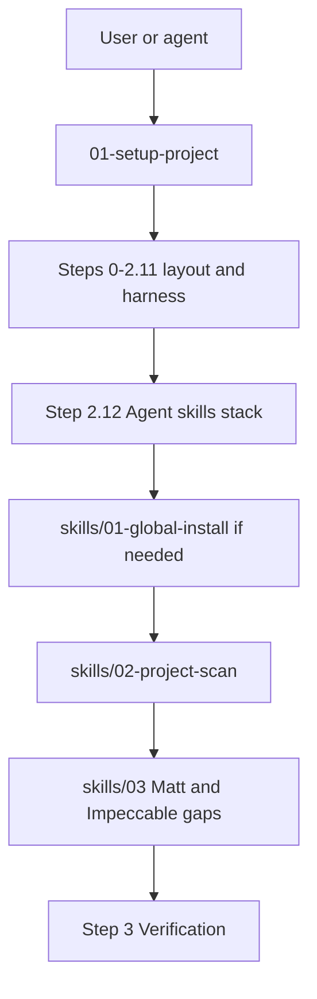

# Simplify setup: 01 is the front door

**Status:** Verified Complete (2026-10-04)  
**Category:** tooling  
**Source:** Cursor plan `simplify_setup_front_door_26d2d2b4`

## Overview

Make `01-setup-project.md` the single front door for new and existing project setup; fold the curated skills stack in as a built-in final step so users do not need a second entry point.

## Locked approach

Users keep doing what they already do: run or update via [01-setup-project.md](../../00-project-setup/01-setup-project.md). The curated skills flow becomes **Step 2.12 (Agent skills stack)** inside that workflow—not a parallel start-at-skills/README path.

[skills/](../../00-project-setup/skills/) stays as the detailed playbook (install commands, scan probes, stubs). Agents land there **from 01**, not instead of 01.

## Changes (executed)

### 1. [01-setup-project.md](../../00-project-setup/01-setup-project.md)

- Intro bullet list: item 8 — after layout, complete the curated agent-skills stack.
- Quick Start: block pointing to Step 2.12.
- **Step 2.12 — Agent skills stack** (after 2.11, before Step 3).
- Existing-project update: first-class Step 2.12.
- Complete Setup Checklist + For AI Agents: Step 2.12 items; Step 3.7.1 verify.

### 2. [skills/README.md](../../00-project-setup/skills/README.md)

- Normal entry is `01-setup-project.md`; this folder is detail for Step 2.12.

### 3. [00-project-setup/README.md](../../00-project-setup/README.md) + [06-skills-setup.md](../../00-project-setup/06-skills-setup.md)

- Decision guide / banners: project setup → only `01`; `skills/` is detail / machine reinstall.

### 4. Changelog

- Docs entry: [../changelog/docs/2026-10-04-docs-01-skills-front-door.md](../changelog/docs/2026-10-04-docs-01-skills-front-door.md)

## Todos

- [x] Add Step 2.12 + Quick Start / checklist / existing-update hooks in 01-setup-project.md
- [x] Reframe skills/README.md and 00-project-setup/README.md so 01 is the only setup front door
- [x] Workflow-Scripts changelog entry for the front-door simplification

## Non-goals (unchanged)

- No merge of full install catalogs into the body of `01`
- No changes to Update-AI-Tools `swe-skills.md`
- No install automation scripts
