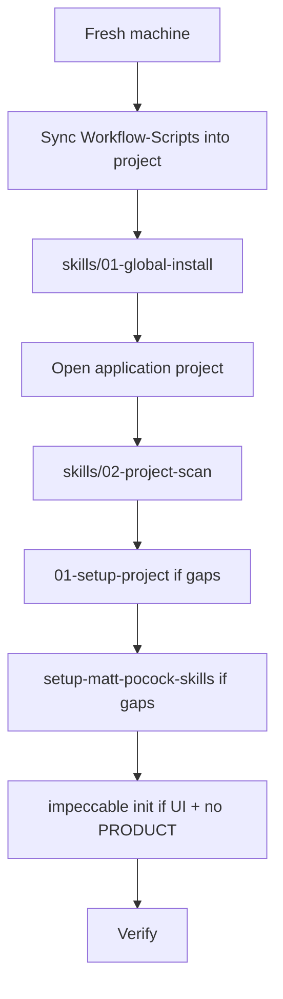

# Skills stack in Workflow-Scripts only

**Status:** Verified Complete (2026-10-04)  
**Category:** tooling  
**Source:** Cursor plan `per-project_skill_scaffolding_3417d49c`  
**Follow-up:** Entry UX later folded into `01-setup-project.md` Step 2.12 — see [2026-10-04-simplify-setup-front-door.md](./2026-10-04-simplify-setup-front-door.md).

## Overview

Make Workflow-Scripts `00-project-setup/skills/` the only portable home for the curated agent-skills stack (fresh machine → global install → project scan → scaffold). Nothing depends on Update-AI-Tools `project/plans/swe-skills.md`.

## Constraint (locked)

**Workflow-Scripts** is what lands in projects. Agents must complete the full stack from that tree alone.

`project/plans/swe-skills.md` is **not** portable and **must not** be required. Used only as a one-time content source to absorb into Workflow-Scripts.

## Problem

Skill guidance was scattered: long catalog in `06-skills-setup.md`, curated clash/install rules only in Update-AI-Tools `swe-skills.md`, agent layout in `01-setup-project.md`, and no shared scan playbook.

## Approach (executed)

1. **Canonical home:** [../../00-project-setup/skills/](../../00-project-setup/skills/)
2. Absorbed precedence, packs, install commands, clashers, and handoff rules into `skills/`
3. Fresh-machine start assumed for Phase 1
4. Scan then act; never wipe indexes or invent PRODUCT.md
5. Wired Workflow-Scripts only (`README`, `01-setup-project`, `06-skills-setup`)
6. Changelog only in Workflow-Scripts `00-project/changelog/`



## Directory layout (shipped)

```
00-project-setup/skills/
├── README.md
├── precedence.md
├── 01-global-install.md
├── 02-project-scan.md
├── 03-project-scaffold.md
└── stubs/
    ├── claude-agent-skills-block.md
    └── product-md-reminder.md
```

## Companion docs changelog

- [../changelog/docs/2026-10-04-docs-skills-stack-setup-subdir.md](../changelog/docs/2026-10-04-docs-skills-stack-setup-subdir.md)

## Todos

- [x] Create `00-project-setup/skills/` with README orchestrator
- [x] Port full swe-skills content into `precedence.md` + `01-global-install.md`
- [x] Add `02-project-scan.md` and `03-project-scaffold.md`
- [x] Add stubs/; wire indexes
- [x] Changelog under Workflow-Scripts only

## Out of scope (unchanged)

- Editing Update-AI-Tools `swe-skills.md`
- Install automation scripts
- Moving Top-250 catalog into `skills/`
- Fabricating PRODUCT.md / glossary without interview
- Overwriting project changelog/troubleshooting indexes
