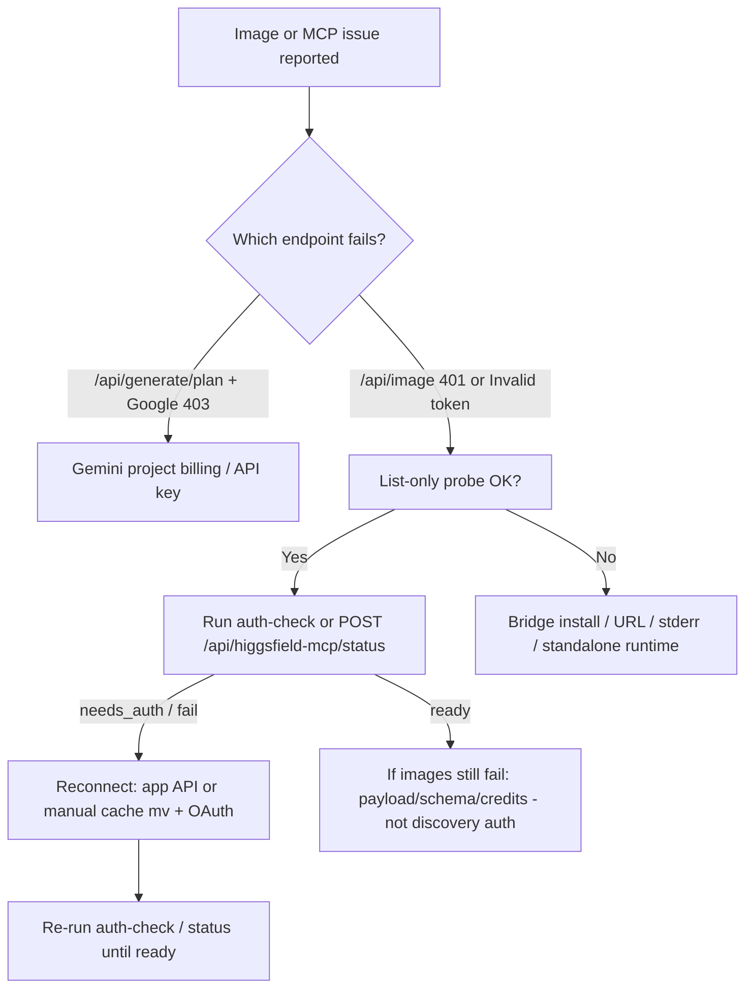

# Higgsfield MCP: Connection, Authentication, and Reconnect — Technical Note

**Created:** 2026-06-03  
**Status:** Reference  
**Scope:** Podcast Creative Studio AI Higgsfield MCP image provider (`higgsfield-mcp`) — bridge startup, OAuth/session lifecycle, readiness probes, app recovery APIs, and common misdiagnoses.  
**Audience:** Developers and operators debugging MCP auth, reconnect flows, or image-batch failures.

**Agent workflow (Workflow-Scripts):** [`08-API-Integration/03-higgsfield-mcp/higgsfield-mcp-connect-auth-reconnect.md`](./03-higgsfield-mcp/higgsfield-mcp-connect-auth-reconnect.md) — step-by-step triage and recovery procedure filed from this note.

This note distills lessons, incidents, and workarounds from production integration work (2026-05-22 through 2026-05-30). Primary sources are listed in [Source documents](#source-documents).

---

## 1. Architecture: Two Auth Boundaries

Higgsfield MCP in Podcast Studio uses `mcp-remote` over stdio against `https://mcp.higgsfield.ai/mcp`. OAuth/session state is stored locally under `~/.mcp-auth/` (typically `~/.mcp-auth/mcp-remote-0.1.37` for the pinned `mcp-remote` version).

**Critical distinction:** MCP has separate success criteria at two layers.

| Layer | What succeeds | What it proves |
|-------|----------------|----------------|
| **Discovery** | `initialize`, `tools/list` | Bridge runs, endpoint reachable, tool catalog visible |
| **Execution** | `tools/call` on `generate_image` (including `get_cost: true`) | Cached OAuth/session accepted for paid/authenticated generation |

A healthy discovery layer does **not** prove generation readiness. Stale or revoked tokens often survive in `~/.mcp-auth/` while `tools/list` still works. Symptom: `Invalid or expired token` on `generate_image` with Higgsfield request IDs, sometimes after `POST /api/image 401`.

**Rule:** Treat `initialize` + `tools/list` as necessary but insufficient. Always verify the execution boundary before batch image work.

---

## 2. Readiness and Recovery Surfaces

### 2.1 CLI probe (developer / CI)

From `Podcast Creative Studio AI 1.1.3b/frontend`:

```bash
# Catalog only — bridge + tools/list (NOT generation-ready)
npm run probe:higgsfield-mcp

# No-spend auth boundary — same idea as app status preflight
npm run probe:higgsfield-mcp -- --auth-check

# Env equivalent
HIGGSFIELD_MCP_PROBE_AUTH_CHECK=1 npm run probe:higgsfield-mcp
```

The `--auth-check` path calls `generate_image` with `get_cost: true` (tiny prompt, default model) so credits are not spent. Success prints `Higgsfield MCP auth preflight passed` and a cost estimate.

Optional: `--aspect-ratio 3:4` to confirm live schema accepts non-square `params.aspect_ratio` without spending credits.

### 2.2 App APIs (in-app recovery)

| Endpoint | Purpose | HTTP mapping (summary) |
|----------|---------|-------------------------|
| `POST /api/higgsfield-mcp/status` | No-spend authenticated preflight (`preflightHiggsfieldMcpAuth`) | `ready` → 200; `needs_auth` → 401; `billing_or_credits_issue` → 402; `unavailable` / `misconfigured` → 503 |
| `POST /api/higgsfield-mcp/reconnect` | Move stale cache to `~/.mcp-auth-backups/`, start OAuth bridge | `reconnect_started` → 200; does not return token values |

**Reconnect semantics:** HTTP 200 on reconnect means **reconnect flow started**, not that OAuth finished or that the next preflight passed. After browser OAuth, call status again (or `--auth-check`) before queuing images.

### 2.3 App UX guards (2026-05-30)

- **Settings:** Selecting `higgsfield-mcp` triggers status; shows Connect/Reconnect when not `ready`.
- **Image batch:** `mediaGenerationController` runs a one-shot readiness check before the image `TaskQueue` when the image model is `higgsfield-mcp`, avoiding repeated `/api/image 401`s.
- **Retry missing images:** After reconnect, reuses stored thumbnail/B-roll prompts.

### 2.4 Manual stale-cache workaround (pre-app or fallback)

When probe or status reports expired/invalid token:

```bash
mv ~/.mcp-auth/mcp-remote-0.1.37 /private/tmp/mcp-remote-0.1.37-stale-$(date +%Y%m%d-%H%M%S)
cd "Podcast Creative Studio AI 1.1.3b/frontend"
npm run probe:higgsfield-mcp -- --auth-check
```

Complete browser OAuth when prompted, then confirm preflight passes.

**Common stale-cache causes:** provider token rotation/revocation, long idle periods, sleep/resume, Higgsfield auth policy changes.

---

## 3. Issue Catalog

Each entry: **symptom → root cause → workaround/fix**.

### 3.1 Stale OAuth cache (discovery OK, generation fails)

| | |
|---|---|
| **Symptom** | `tools/list` / default probe OK; `generate_image` → `Invalid or expired token`; `/api/image 401` on batch |
| **Root cause** | Stale `mcp-remote` cache under `~/.mcp-auth/` |
| **Workaround** | Move cache aside; re-run `--auth-check` or app reconnect + OAuth; verify status 200 |
| **Permanent fix** | `--auth-check` probe; `/api/higgsfield-mcp/status` + `/reconnect`; batch preflight guard |
| **Sources** | `2026-05-22` expired token; `2026-05-25` stale auth cache; `2026-05-30` auth boundary probe |

### 3.2 List-only probe false confidence

| | |
|---|---|
| **Symptom** | `npm run probe:higgsfield-mcp` passes; production images still 401/503 |
| **Root cause** | Default probe only exercises discovery layer |
| **Workaround** | Always use `--auth-check` before runs that need MCP images |
| **Sources** | `2026-05-25` stale auth cache; `docs/configuration/README.md` |

### 3.3 Reconnect 200 but workflow still fails

| | |
|---|---|
| **Symptom** | User reconnects Higgsfield; generation fails immediately after |
| **Root cause (common)** | Failure is on a **different** provider/step (e.g. Gemini plan), not Higgsfield token |
| **Workaround** | Check failing endpoint in logs (`/api/generate/plan` vs `/api/image`); confirm `/api/higgsfield-mcp/status` 200 separately |
| **Sources** | `2026-05-30` auth failure investigation; Gemini dunning after reconnect |

### 3.4 Gemini dunning mistaken for Higgsfield auth failure

| | |
|---|---|
| **Symptom** | After Higgsfield status/reconnect success, `/api/generate/plan` fails with Google 403 `PERMISSION_DENIED` / “Lightning dunning decision is deny” |
| **Root cause** | Google/Gemini project billing or access denial — workflow never reaches `/api/image` |
| **Workaround** | Fix Gemini project billing or switch `APP_GEMINI_API_KEY`; do not chase Higgsfield OAuth |
| **Note** | App maps this to HTTP 403 `GEMINI_PROJECT_ACCESS_DENIED` (not generic 500) |
| **Sources** | `2026-05-30` investigation; `runtime/2026-05-30-runtime-gemini-dunning-after-higgsfield-reconnect.md` |

### 3.5 Wrong MCP endpoint URL

| | |
|---|---|
| **Symptom** | Bridge exit code 1; `Route POST:/ not found` |
| **Root cause** | Default URL missing `/mcp` path |
| **Fix** | Use `https://mcp.higgsfield.ai/mcp`; capture bridge **stderr** (exit code alone is useless) |
| **Sources** | `2026-05-22` bridge endpoint troubleshooting |

### 3.6 macOS packaged app: bridge cannot start

| | |
|---|---|
| **Symptom** | Standalone/Electron build cannot spawn `mcp-remote` |
| **Root cause** | Incomplete `mcp-remote` dependency closure in standalone bundle |
| **Fix** | Ship full hoisted lockfile closure for MCP runtime packages |
| **Sources** | `2026-05-23` standalone runtime; hoisted dependencies changelog |

### 3.7 Host connector OK, app bridge fails (isolated session)

| | |
|---|---|
| **Symptom** | External Higgsfield MCP connector succeeds on `get_cost`; app bridge fails same call |
| **Root cause** | App-local `mcp-remote` session/auth boundary, not prompt or endpoint |
| **Workaround** | Refresh app-local cache; compare host vs app-bridge probes |
| **Sources** | `2026-05-22` expired token troubleshooting |

---

## 4. Distilled Lessons (MCP + Higgsfield)

### 4.1 Authentication and connection

1. **Separate auth layers** — Discovery auth ≠ execution auth. Never ship or document list-only checks as “ready for generation.”
2. **No-spend execution probe** — Use `generate_image` with `get_cost: true` for readiness; default catalog probe stays list-only by design.
3. **Reconnect ≠ ready** — Reconnect 200 = flow started; require follow-up status 200 or `--auth-check` pass.
4. **Classify reauth clearly** — Map `Invalid or expired token` (and related OAuth failures) to `needs_auth` / 401 with actionable reconnect instructions, not generic 503.
5. **Timeline traps** — Failures right after Higgsfield auth often belong to the **next** step (Gemini plan). Read endpoint + upstream host in logs.
6. **Disable placeholder MCP servers** — Unconfigured local MCP entries create auth noise during diagnosis.

### 4.2 Bridge, transport, and errors

7. **Check `result.isError`** — MCP tool failures return successful JSON-RPC with `result.isError: true`; do not rely only on `message.error`.
8. **Capture stderr** — Bridge exit codes hide remote errors; include child stderr in diagnostics.
9. **Endpoint path** — Live MCP URL must include `/mcp`.
10. **`structuredContent` first** — Prefer `structuredContent` over parsing `text` for machine-readable MCP responses.

### 4.3 Payload, models, and provider behavior

11. **Live schema is truth** — Use `models_explore` / probe-printed `generate_image` schema; do not assume `quality`, `mode`, or `reference_images` keys.
12. **Normalize at boundaries** — e.g. MCP resolution lowercase (`1k`) while internal UI may use `1K` for Google paths.
13. **Separate model ID namespaces** — SDK paths, MCP slugs (`nano_banana_2`), and CLI names must not be mixed.
14. **Immediate vs polled results** — Some MCP surfaces return images from `generate_image` without a separate status tool; support both paths.
15. **Parallel timeouts** — Timeout must cover slowest job when up to four concurrent MCP images queue.
16. **Fail closed on explicit provider** — User-selected `higgsfield-mcp` must not silently fall back to Google on error.
17. **403 from Higgsfield** — Often means routing/auth OK; check credits/account state, not request shape.

### 4.4 Operations and packaging

18. **Probe before wiring** — `npm run probe:higgsfield-mcp` after provider or bridge changes; treat failures as blockers.
19. **Packaged macOS** — Verify `mcp-remote` runtime and hoisted deps in standalone builds.
20. **Config visibility** — Provider must be `enabled: true` in shipped config with at least one enabled model; map `higgsfield-mcp` (ID) ↔ `higgsfieldMcp` (config key).

---

## 5. Diagnostic Flow (recommended)



**Quick checks**

1. `npm run probe:higgsfield-mcp -- --auth-check` (or app status → 200).
2. If plan fails before images: inspect `/api/generate/plan` and Gemini project state.
3. If auth-check fails: reconnect + OAuth, never assume list-only pass means fixed.
4. For payload errors: inspect `result.isError` text and live `generate_image` schema.

---

## 6. Status and error taxonomy (app)

`preflightHiggsfieldMcpAuth()` / status route classifications:

| Status | Meaning | Typical action |
|--------|---------|----------------|
| `ready` | No-spend `generate_image` `get_cost` succeeded | Proceed with image batch |
| `needs_auth` | Stale/expired OAuth at execution boundary | Reconnect + browser OAuth |
| `billing_or_credits_issue` | Upstream billing/credits signal | Account/credits on Higgsfield side |
| `unavailable` | Bridge/process/transport failure | Check bridge, stderr, packaged runtime |
| `misconfigured` | Missing tool, wrong URL, env | Fix config / probe endpoint |

---

## 7. Principles for Future MCP Providers

1. Build a **no-spend probe** before production wiring (list + optional execution boundary).
2. Treat **`result.isError`** as failure even when JSON-RPC succeeds.
3. **Never** document catalog-only checks as generation-ready.
4. Provide **app-owned reconnect** that moves cache aside without exposing tokens.
5. **Guard batches** once before N parallel paid calls.
6. When users auth provider A then fail, **verify the failing hop** before blaming A.
7. Keep **provider-specific normalization** at the MCP call boundary.
8. Use **live tool schema** as authority; hide UI for undeclared parameters.

---

## 8. Source documents

### Operator runbook

- `docs/configuration/README.md` — “Higgsfield MCP Auth Preflight and Stale Cache Recovery”

### Troubleshooting (runtime)

| Date | Topic | Path |
|------|-------|------|
| 2026-05-30 | Auth recovery (status/reconnect/guards) | `project/troubleshooting/runtime/2026-05-30-runtime-higgsfield-mcp-auth-boundary-probe.md` |
| 2026-05-30 | Gemini dunning after reconnect | `project/troubleshooting/runtime/2026-05-30-runtime-gemini-dunning-after-higgsfield-reconnect.md` |
| 2026-05-25 | Stale auth cache | `project/troubleshooting/runtime/2026-05-25-runtime-higgsfield-mcp-stale-auth-cache.md` |
| 2026-05-22 | Expired token | `project/troubleshooting/runtime/2026-05-22-runtime-higgsfield-mcp-expired-token.md` |
| 2026-05-22 | Bridge endpoint | `project/troubleshooting/runtime/2026-05-22-runtime-higgsfield-mcp-bridge-endpoint.md` |
| 2026-05-22 | Resolution casing | `project/troubleshooting/runtime/2026-05-22-runtime-higgsfield-mcp-resolution-casing.md` |
| 2026-05-22 | Parallel timeout | `project/troubleshooting/runtime/2026-05-22-runtime-higgsfield-mcp-parallel-timeout.md` |
| 2026-05-23 | macOS standalone runtime | `project/troubleshooting/runtime/2026-05-23-runtime-macos-higgsfield-mcp-standalone-runtime.md` |

### Plans and investigations

- `project/plans-completed/investigation/2026-05-30-higgsfield-mcp-auth-failure-investigation.md`
- `project/plans-completed/implementation/2026-05-30-higgsfield-mcp-auth-recovery-implementation-plan.md`
- `project/plans-completed/higgsfield-mcp-support/higgsfield-support/2026-05-22-higgsfield-mcp-lessons-learnt.md` — broader MCP integration lessons (payload, casing, probes, model IDs)

### Changelog index

- [00-project/changelog/index.md](../../../00-project/changelog/index.md) — rows tagged Higgsfield MCP Auth / Reconnect / Preflight (2026-05-22 through 2026-05-31)

---

## 9. Code touchpoints (implementation)

| Area | Path |
|------|------|
| Provider + preflight | `Podcast Creative Studio AI 1.1.3b/frontend/lib/server/image-providers/higgsfieldMcpProvider.ts` |
| Auth recovery helpers | `Podcast Creative Studio AI 1.1.3b/frontend/lib/server/higgsfield-mcp/authRecovery.ts` |
| Status API | `Podcast Creative Studio AI 1.1.3b/frontend/app/api/higgsfield-mcp/status/route.ts` |
| Reconnect API | `Podcast Creative Studio AI 1.1.3b/frontend/app/api/higgsfield-mcp/reconnect/route.ts` |
| CLI probe | `Podcast Creative Studio AI 1.1.3b/frontend/scripts/higgsfield-mcp-probe.mjs` |
| Batch guard | `Podcast Creative Studio AI 1.1.3b/frontend/lib/utils/mediaGenerationController.ts` |
| Settings UI | `Podcast Creative Studio AI 1.1.3b/frontend/components/SettingsPanel.tsx` |

---

*This note is a distilled reference. For incident-specific evidence and verification commands, use the linked troubleshooting and investigation files.*
